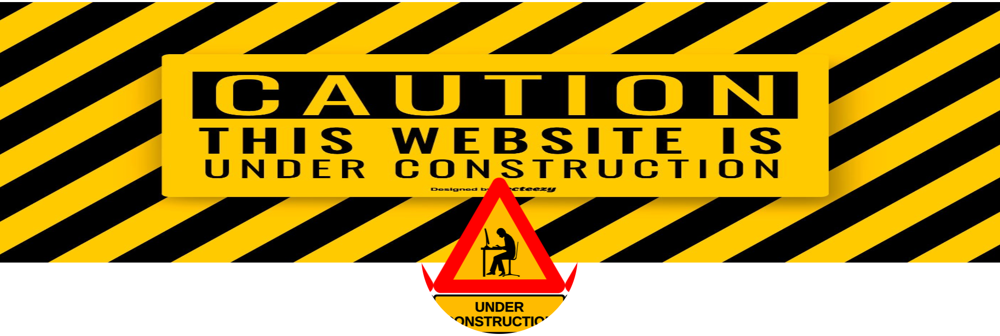

# react-portfolio2021

This has been a difficult 2 years for me with all that has been going on in the world.
Shortly after certifying as a developer, I took a break from being online.

I'm back.

Please be patient while I update a few things. I have a lot of ideas and changes
I want to make to not only improve my code, but to integrate those ideas as part of the portfolio.

One such project that I have worked on is a screen recorder for my computer.
NO MORE TIME LIMITS.
I need to add a few additional features to utilize my web-cam, but this will allow me to include more video in the portfolio that discuss the projects I'm working on and what the code does.

